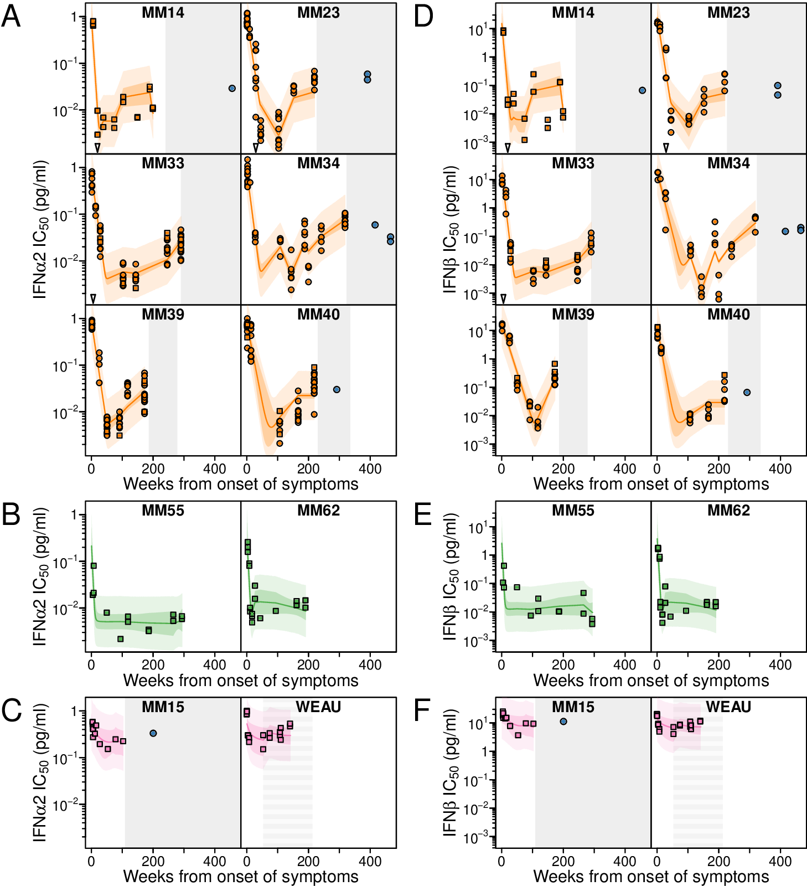
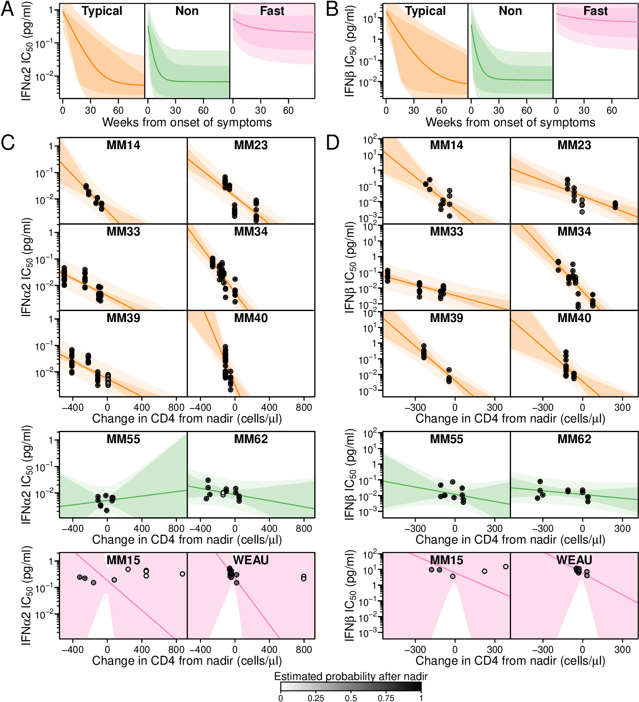
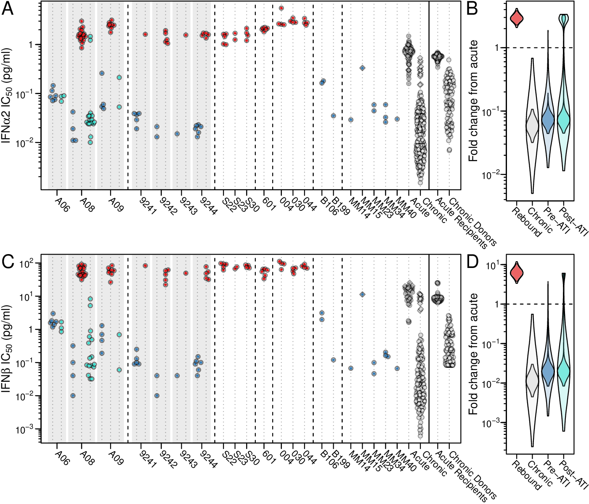

# Analysis code for "Heightened resistance to type 1 interferons characterizes HIV-1 at transmission and following treatment interruption"

To regenerate the analysis, run `source('bayesLongitudinal.R')` and `source('bayesReboundQvoa.R')` in this directory. 

The code depends on the R package `rstan` available from CRAN (`install.packages('rstan')`) and was run in R version 3.4.4 with `rstan` version 2.23. The code can take a fair bit of resources and computational time so a fairly fast server would be best for rerunning.

This code should generate analysis result files in the `out` directory. Example output is available in the `exampleOut` directory.

In addition, HIV-1 genome sequences without ambiguities are archived on GenBank while genomes with ambiguities (due to amplification from bulk isolates) are archived in [data/TableS5Sequences.fasta](data/TableS5Sequences.fasta).

## Longitudinal IFN resistance dynamics

## Changepoint model of IFN resistance with an initial drop and subsequent correlation with CD4 count

## IFN resistance of rebound and outgrowth HIV-1 isolates

